# Project: Perception Pick & Place

This 3D perception project uses an advanced robotics platform called the PR2 in simulation together with RBG-D data.

---

# Required Steps for a Passing Submission:
1. Done: Extract features and train an SVM model on new objects (see `pick_list_*.yaml` in `/pr2_robot/config/` for the list of models you'll be trying to identify). 
2. Done: Write a ROS node and subscribe to `/pr2/world/points` topic. This topic contains noisy point cloud data that you must work with.
3. Done: Use filtering and RANSAC plane fitting to isolate the objects of interest from the rest of the scene.
4. Done: Apply Euclidean clustering to create separate clusters for individual items.
5. Done: Perform object recognition on these objects and assign them labels (markers in RViz).
6. Done: Calculate the centroid (average in x, y and z) of the set of points belonging to that each object.
7. Done: Create ROS messages containing the details of each object (name, pick_pose, etc.) and write these messages out to `.yaml` files, one for each of the 3 scenarios (`test1-3.world` in `/pr2_robot/worlds/`).  See the example `output.yaml` for details on what the output should look like.  
8. Done: Submit a link to your GitHub repo for the project or the Python code for your perception pipeline and your output `.yaml` files (3 `.yaml` files, one for each test world).  You must have correctly identified 100% of objects from `pick_list_1.yaml` for `test1.world`, 80% of items from `pick_list_2.yaml` for `test2.world` and 75% of items from `pick_list_3.yaml` in `test3.world`.
9. Congratulations!  Your Done!

# Extra Challenges: Complete the Pick & Place
7. To create a collision map, publish a point cloud to the `/pr2/3d_map/points` topic and make sure you change the `point_cloud_topic` to `/pr2/3d_map/points` in `sensors.yaml` in the `/pr2_robot/config/` directory. This topic is read by Moveit!, which uses this point cloud input to generate a collision map, allowing the robot to plan its trajectory.  Keep in mind that later when you go to pick up an object, you must first remove it from this point cloud so it is removed from the collision map!
8. Rotate the robot to generate collision map of table sides. This can be accomplished by publishing joint angle value(in radians) to `/pr2/world_joint_controller/command`
9. Rotate the robot back to its original state.
10. Create a ROS Client for the “pick_place_routine” rosservice.  In the required steps above, you already created the messages you need to use this service. Checkout the [PickPlace.srv](https://github.com/udacity/RoboND-Perception-Project/tree/master/pr2_robot/srv) file to find out what arguments you must pass to this service.
11. If everything was done correctly, when you pass the appropriate messages to the `pick_place_routine` service, the selected arm will perform pick and place operation and display trajectory in the RViz window
12. Place all the objects from your pick list in their respective dropoff box and you have completed the challenge!
13. Looking for a bigger challenge?  Load up the `challenge.world` scenario and see if you can get your perception pipeline working there!

## [Rubric](https://review.udacity.com/#!/rubrics/1067/view) Points
### Here I will consider the rubric points individually and describe how I addressed each point in my implementation.  

---
### Writeup / README

#### 1. Provide a Writeup / README that includes all the rubric points and how you addressed each one.  You can submit your writeup as markdown or pdf.  

You're reading it!

### Exercise 1, 2 and 3 pipeline implemented

#### 1. Complete Exercise 1 steps. Pipeline for filtering and RANSAC plane fitting implemented.

1. Converted the incoming ROS cloud to PCL format so that the useful functions in the PCL library can be used.

Note: several values below have been slightly refined/updated in the later Exercises (2,3) and Project.

2. Downsampled the image with a PCL voxel grid filter to reduce processing time and memory consumption. The leaf size is the side length of the voxel cube to average over. I used leaf size of 0.01 to balance the gain in computation speed and resolution loss.

3. Used passthrough filter to define the region of interest. This filter clipped the volume to the specified range. My region of interest here was in the range of 0.6 < z < 1.1.
 
4. Used RANSAC plane segmentation to separate the table from the objects on it. A maximum threshold of 0.01 worked well here. The cloud is then segmented in two parts the table (inliers) and the objects of interest (outliers). 

5. The .pcd files have been saved from the above steps and screenshot of the images were displayed in the Image_of_PCDs.jpg file:

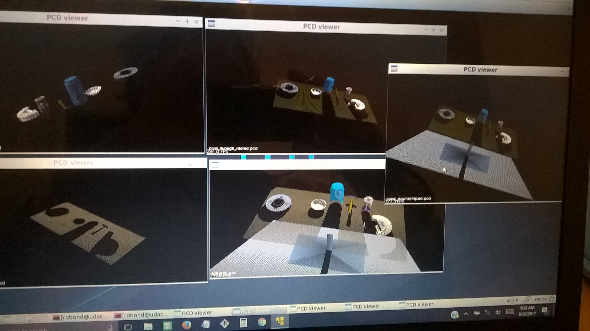 

6. In the statistical_outlier_filter file, it filtered out the camera noise with the PCL statistical outlier filter. There are  two parameters (k - neighbouring pixels to average over, x -outlier threshold: thr = mean_distance + x * std_dev) can be tuned to remove as much noise as possible without deleting content.

Note: this step (6) was done first in the Project.

#### 2. Complete Exercise 2 steps: Pipeline including clustering for segmentation implemented.  

1. Repeated steps 1-4 of Exercise 1, with vox's leaf size = 0.005, and passThrough region of interest: 0.75 < z < 1.1 and -3 < y < -1.35.

Note: This Exercise took the objects cloud created in Exercise 1 and clustering it into detectable individual objects.

2. The colour information was removed and a white cloud created. 

3. Applied Euclidean Clustering with cluster tolerance = 0.01, minimum cluster size = 600, and maximum cluster size = 3000. The optimal values for Euclidean clustering depend on the leaf size defined above, since the voxel grid determines the point density in the image. 

4. Used k-d tree method to search for clusters. The discovered clusters were extracted with indices.  

5. Applied a different colour to each detected cluster, as shown in the lesson.

6. The PCL clouds then converted to ROS format and published to various topics so they can be visualised in RViz. 

The screenshots of this Exercise 2 are:

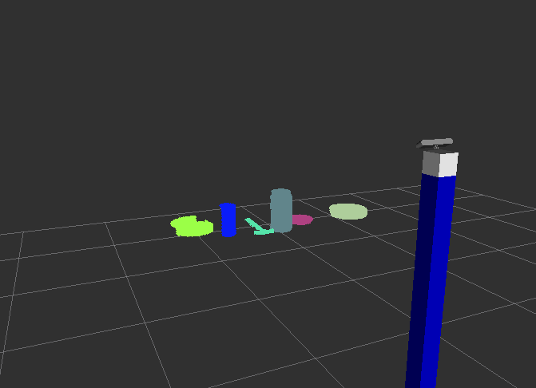 
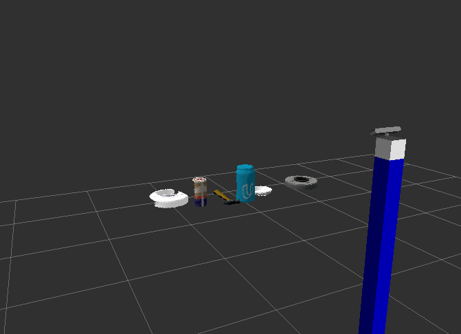 
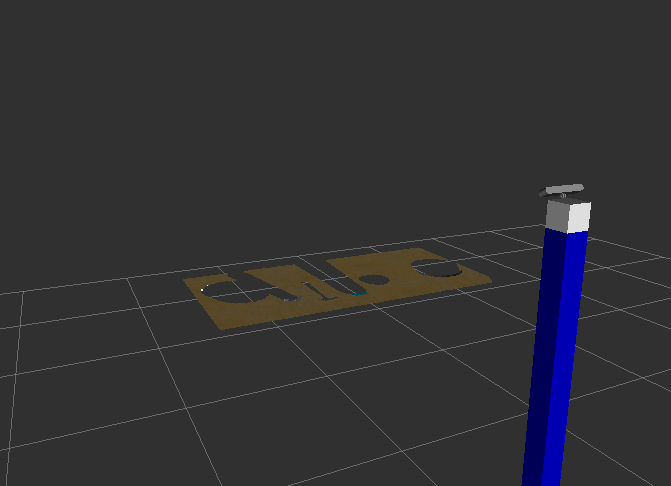 

#### 3. Complete Exercise 3 Steps.  Features extracted and SVM trained.  Object recognition implemented.
Here is an example of how to include an image in your writeup.

1. I've implemented the compute_color_histograms() and compute_normal_histograms() functions in (./Exercise-3/sensor_stick/src/sensor_stick/features.py) according to the lesson notes. Set a range of [0,256] for the colours and [-1,1] for the normals and used bins=32 for both. 

Since an object is characterized by the distribution of color channels, and the distribution of surface normals. I have tried bin size of 32 and 64 and decided to use 32. Also, HSV color space resulted higher accuracies (than RGB color space). 

2.  Updated ./Exercise-3/sensor_stick/scripts/capture_features.py,
increased iterations for each model (from default 5) to 30. The generated training_set.sav file after running: rosrun sensor_stick capture_features.py, was copied from catkin_ws directory to ./Exercise-3/sensor_stick/scripts/ directory for reference.

3. For the train_svm.py file (in ./Exercise-3/sensor_stick/scripts/ directory), I have tried additional parameters (like: C=1.0, gamma=auto) when creating svm classifer (ex: clf = svm.SVC(arg,arg,arg)), but decided to leave it with only this one parameter (kernel=linear). 

Therefore, SVM had been trained using train_svm.py. The generated model.sav file after running: rosrun sensor_stick train_svm.py, was copied from catkin_ws directory to ./Exercise-3/sensor_stick/scripts/ directory for reference.

This improved accuracies of the models which can be seen in the following normalized confusion matrix screenshot:

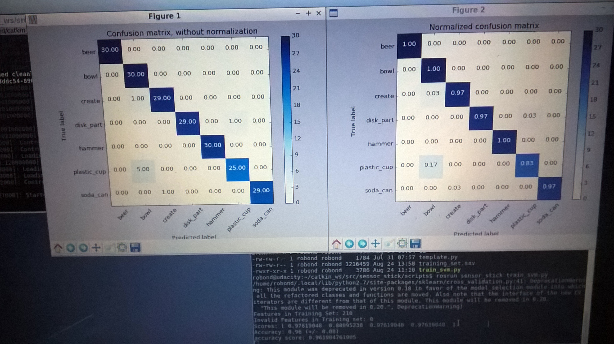 

4. Object recognition steps had been implemented in the pcl_callback() function within the object_recognition.py file in ./Exercise-3/sensor_stick/scripts/ directory. 

I copied and pasted the code inside the perception pipeline to identify individual object clusters in Exercise-2 to object_recognition.py file here.

5. The trained model was then used in the pcl_callback routine to infer class labels from the given clusters. (i.e. the model.save file was loaded (in line 175), and clf, encoder, and scaler were derived (in line 176-179), and used (in line 135-137)).

For each cluster in the list, the features were calculated and the classifier predicted the most probable object label. These labels were published to /object_markers (i.e. to RViz) and the detected objects of type DetectedObject() were published to /detected_objects.

6. The screenshots of Object Recognition can be seen in the followings:

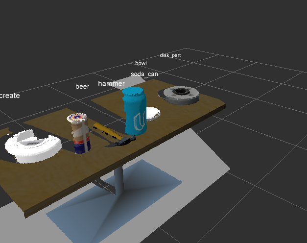 
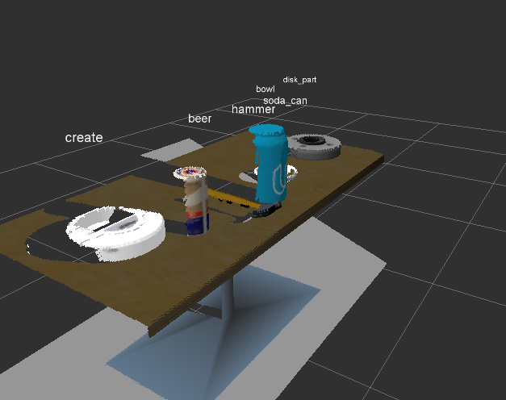 

Here's | A | Snappy | Table
--- | --- | --- | ---
1 | `highlight` | **bold** | 7.41
2 | a | b | c
3 | *italic* | text | 403
4 | 2 | 3 | abcd

### Pick and Place Setup

#### 1. For all three tabletop setups (test*.world), perform object recognition, then read in respective pick list (`pick_list_*.yaml`). Next construct the messages that would comprise a valid `PickPlace` request output them to `.yaml` format.

1. I used Exercise 3 (step 2 and step 3 described above) environment, and generated model.sav for all three tabletop setups. Listed the relevant files below for reference:

./pr2_robot/scripts/testcase1/capture_features_project_tr_1.py
./pr2_robot/scripts/testcase1/training_set.sav
./pr2_robot/scripts/testcase1/model.sav
./pr2_robot/scripts/testcase2/capture_features_project_tr_2.py
./pr2_robot/scripts/testcase2/training_set.sav
./pr2_robot/scripts/testcase2/model.sav
./pr2_robot/scripts/testcase3/capture_features_project_tr_3.py
./pr2_robot/scripts/testcase3/training_set.sav
./pr2_robot/scripts/testcase3/model.sav

These improved accuracies of the models can be seen in the following normalized confusion matrix screenshots:

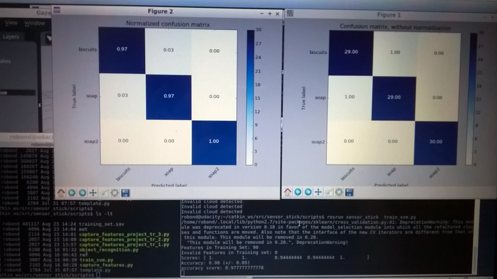
 
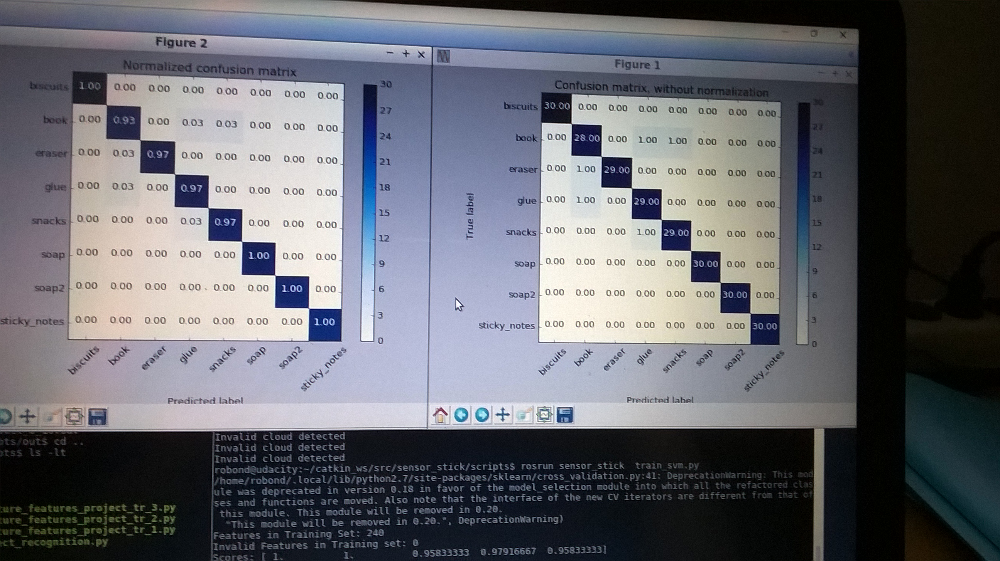  

2. Copied Exercise 3 code into project_template.py, and all the objects were detected and classified. 

3. I then called pr2_mover() function to create the output_[1,2,3].yaml files. 

Below is the step by step description of the pr2_mover function:

* read in the objects from the pick_list_n file and assigned to object_list_param 
* read in the dropbox info and associated dropbox position to dropbox name in dict_dropbox array
* the main loop iterated over all the (item/obj) from the (pick list/object_list_param). 

  Inside the main loop:
    * init the pick_pose and place_pose to 0, this is ok, because they will be over written 
    * set object_name (based on the data from pick_list_n.yaml)
    * set test_scene_num
    * set arm_name based on group (red or green) from pick list and translated to (left or right)
    * fetched place_pose position (x y z) based on arm_name (left or right) of the dict_dropbox
    * loop through the detected_object in object_list
      if the detected_object.label equal to object_name, 
      then derived pick_pose position from detected_object.cloud
      (ref lesson notes on calculation of centroid of object) 
    * call make_yaml_dict with the above parameters
      and appended it to dict_list
* when it came out of the main loop, call send_to_yaml with yaml_filename and dict_list

4. The output yaml files are located at:
    ./pr2_robot/scripts/output_1.yaml
    ./pr2_robot/scripts/output_2.yaml
    ./pr2_robot/scripts/output_3.yaml

5. The screenshots of three scenario/tabletop-setups/test*.world are located at:

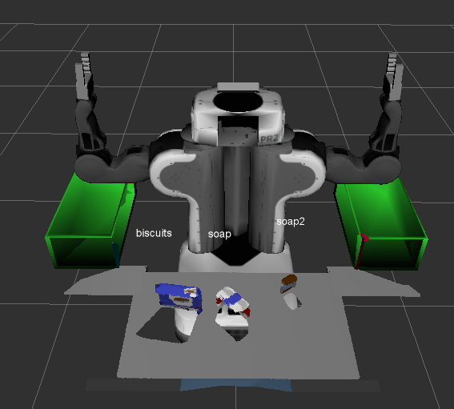 
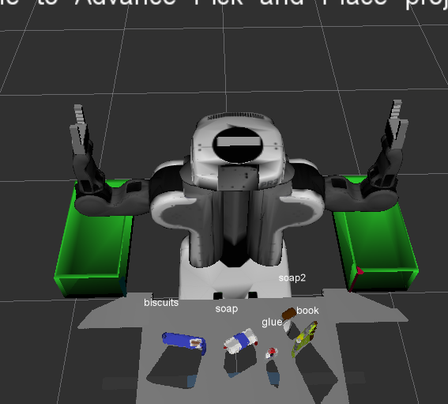 
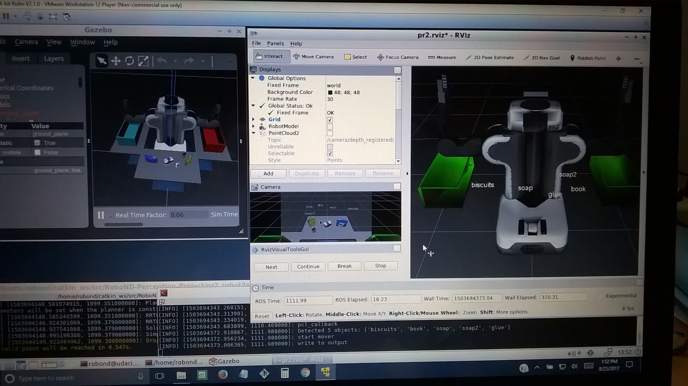 
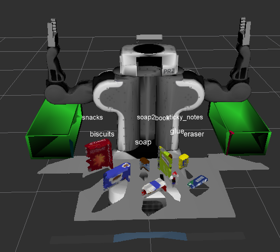 
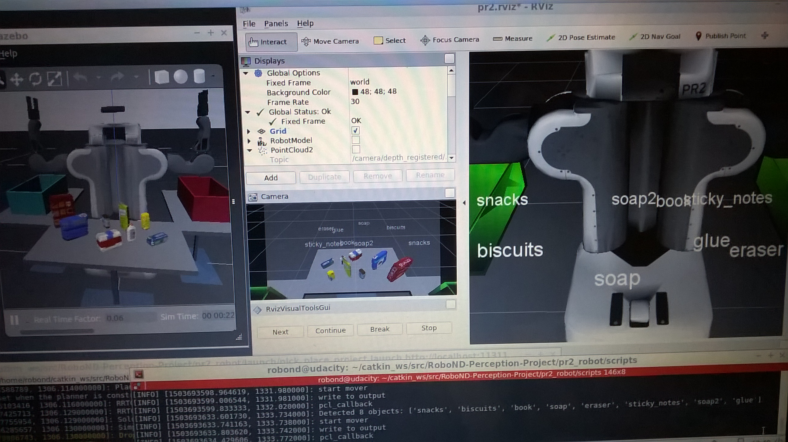 

6. As shown above (iamges and output yaml files), it has  correctly identified 100% of objects from `pick_list_1.yaml` for `test1.world`, 100% of items from `pick_list_2.yaml` for `test2.world` and 100% of items from `pick_list_3.yaml` in `test3.world`.

And here's another image! 

Spend some time at the end to discuss your code, what techniques you used, what worked and why, where the implementation might fail and how you might improve it if you were going to pursue this project further.

This course really consumes me and I am behind. I just read the lessons again and again until I understand and sink in.

If I have more time, I would like to figure out how the whole thing works. So that I know how to fix those red error messages. Currently, many things are provided to me to run the project.
  

